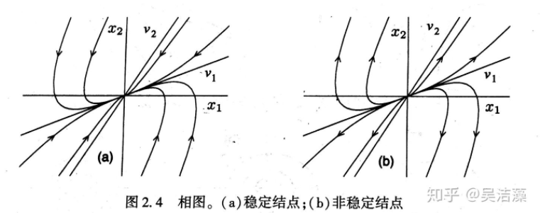
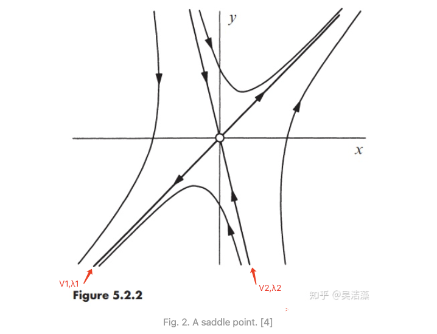

# linear systems

## 二维线性系统的特性

一般地，矩阵 ![[公式]](https://www.zhihu.com/equation?tex=A) 的特征值可以由特征方程 ![[公式]](https://www.zhihu.com/equation?tex=det%28A-%5Clambda+I%29%3D0) 解得，这里 ![[公式]](https://www.zhihu.com/equation?tex=I) 表示单位矩阵. 对于一个 ![[公式]](https://www.zhihu.com/equation?tex=2%5Ctimes2) 矩阵

![[公式]](https://www.zhihu.com/equation?tex=A+%3D++%5Cleft%28%5Cbegin%7Barray%7D+%7Bcc%7D+a+%26b%5C%5C+c+%26d%5C%5C+%5Cend%7Barray%7D%5Cright%29+%5C%5C)

 特征方程为

![[公式]](https://www.zhihu.com/equation?tex=det+%5Cleft%28%5Cbegin%7Barray%7D%7Bcc%7D+a-%5Clambda++%26b%5C%5C+c+%26d-%5Clambda+%5Cend%7Barray%7D%5Cright%29%3D0+%5C%5C)

展开行列式得

![[公式]](https://www.zhihu.com/equation?tex=%5Clambda%5E2-%5Ctau%5Clambda%2B%5CDelta%3D0+%5Ctag%7B4%7D+%5C%5C) 

这里

![[公式]](https://www.zhihu.com/equation?tex=%5Ctau+%3D+trace%28A%29%3Da%2Bd%5C%5C+%5CDelta%3Ddet%28A%29%3Dad-bc+%5C%5C) 

因此

![[公式]](https://www.zhihu.com/equation?tex=%5Clambda_%7B1%2C+2%7D%3D%5Cfrac%7B%5Ctau%5Cpm%5Csqrt%7B%5Ctau%5E2-4%5CDelta%7D%7D%7B2%7D+%5Ctag%7B5%7D%5C%5C)

特征值只依赖于矩阵 ![[公式]](https://www.zhihu.com/equation?tex=A) 的迹(trace)和行列式(determinant). 矩阵 ![[公式]](https://www.zhihu.com/equation?tex=A) 的特征值决定了系统的特性.

### 1.**两个特征值都为实数， ![[公式]](https://www.zhihu.com/equation?tex=%5Clambda_1%5Cneq%5Clambda_2%5Cneq0)**

任何初始条件 ![[公式]](https://www.zhihu.com/equation?tex=%5Ctextbf+x_0) 都可以被写成特征向量的线性组合，即 ![[公式]](https://www.zhihu.com/equation?tex=%5Ctextbf+x_0%3Dc_1%5Ctextbf+v_1%2Bc_2%5Ctextbf+v_2) . 由此我们可以写出一个通解

![[公式]](https://www.zhihu.com/equation?tex=%5Ctextbf+x%28t%29%3Dc_1e%5E%7B%5Clambda_1t%7D%5Ctextbf+v_1%2Bc_2e%5E%7B%5Clambda_2t%7D%5Ctextbf+v_2+%5Ctag%7B6%7D%5C%5C)

#### 1.1两个特征值都为负. 不失一般性，设 ![[公式]](https://www.zhihu.com/equation?tex=%5Clambda_2%3C%5Clambda_1%3C0).

**称 ![[公式]](https://www.zhihu.com/equation?tex=%5Clambda_2)为快特征值(fast)，而 ![[公式]](https://www.zhihu.com/equation?tex=%5Clambda_1) 为慢特征值(slow).** 

 **![[公式]](https://www.zhihu.com/equation?tex=%5Ctextbf+v_2) 为快特征向量，而 ![[公式]](https://www.zhihu.com/equation?tex=%5Ctextbf+v_1) 为慢特征向量.** 

**x=(0,0) 成为 稳定结点（stable node）**

**轨迹线与慢特征向量相切，与快特征平行**

### 1.2. 两个特征值都为正，设 ![[公式]](https://www.zhihu.com/equation?tex=%5Clambda_2%3E%5Clambda_1%3E0) .

此时相图和稳定结点的特征相似但轨线方向相反. 不动点原点称为**非稳定结点(unstable node)**.

### 1.3. 两个特征值符号相反，设 ![[公式]](https://www.zhihu.com/equation?tex=%5Clambda_2%3C0%3C%5Clambda_1) . 

![[公式]](https://www.zhihu.com/equation?tex=%5Clambda_2)  = 稳定特征值

![[公式]](https://www.zhihu.com/equation?tex=%5Clambda_1)  = 非稳定特征值

V2 = 稳定向量

V1 = 非稳定向量

不动点原点称为**鞍点(saddle point)**.

### 第二种情况 特征值为复数，$\lambda_{1,2} = \alpha ± iw$

![[公式]](https://www.zhihu.com/equation?tex=%5Cquad) 此时， ![[公式]](https://www.zhihu.com/equation?tex=%5Calpha%3D%5Ctau%2F2%2C+%5Comega%3D%5Csqrt%7B4%5CDelta-%5Ctau%5E2%7D%2F2). 根据假设 ![[公式]](https://www.zhihu.com/equation?tex=%5Comega%5Cneq0) , 因此系统的通解仍然可以写成(6), 由Euler公式 ![[公式]](https://www.zhihu.com/equation?tex=e%5E%7Bi%5Comega+t%7D%3D%5Ccos%7B%5Comega+t%7D%2Bi%5Csin%7B%5Comega+t%7D) , 此时 ![[公式]](https://www.zhihu.com/equation?tex=%5Ctextbf+x%28t%29) 是 ![[公式]](https://www.zhihu.com/equation?tex=e%5E%7B%5Calpha+t%7D%5Ccos%7B%5Comega+t%7D) 和 ![[公式]](https://www.zhihu.com/equation?tex=e%5E%7B%5Calpha+t%7D%5Csin%7B%5Comega+t%7D) 的线性组合.

####  当 ![[公式]](https://www.zhihu.com/equation?tex=%5Calpha+%3DRe%28%5Clambda%29%3C0) 时，指数衰减振荡，平衡点原点称为**稳定焦点(stable spiral)**；

#### 当 ![[公式]](https://www.zhihu.com/equation?tex=%5Calpha%3E0) 时，指数增长振荡，平衡点称为**非稳定焦点(unstable spiral)**；

#### 当 ![[公式]](https://www.zhihu.com/equation?tex=%5Calpha%3D0) 时，稳定振荡，平衡点称为**中心(center)**.

Fig. 3. Spirals and center. [2]

### **第三种情况 多重非零特征值， ![[公式]](https://www.zhihu.com/equation?tex=%5Clambda_1%3D%5Clambda_2%3D%5Clambda%5Cneq0)**

![[公式]](https://www.zhihu.com/equation?tex=%5Cquad) 如果仍有两个线性无关的特征向量，那么任意向量也是特征值 ![[公式]](https://www.zhihu.com/equation?tex=%5Clambda) 的特征向量. 这是因为任意向量 ![[公式]](https://www.zhihu.com/equation?tex=%5Cbf+x_0) 都是这两个特征向量的组合，因此自身也是一个特征向量. 

这时矩阵形如

![[公式]](https://www.zhihu.com/equation?tex=A%3D%5Cleft%28+%5Cbegin%7Barray%7D%7Bcc%7D+%5Clambda+%260%5C%5C+0+%26%5Clambda%5C%5C++%5Cend%7Barray%7D+%5Cright%29+%5C%5C) 

所有轨线都是经过原点的直线，不动点原点为一个**星结点(star node)**，

在 ![[公式]](https://www.zhihu.com/equation?tex=%5Clambda%3E0) 时为非稳定结点， ![[公式]](https://www.zhihu.com/equation?tex=%5Clambda%3C0) 时为稳定结点.

Fig. 4. A star node. [4]

![[公式]](https://www.zhihu.com/equation?tex=%5Cquad) 如果只有一个特征向量，例如任何

形如 ![[公式]](https://www.zhihu.com/equation?tex=A%3D%5Cleft%28+%5Cbegin%7Barray%7D%7Bcc%7D+%5Clambda+%26b%5C%5C+0+%26%5Clambda%5C%5C++%5Cend%7Barray%7D+%5Cright%29+) 且 ![[公式]](https://www.zhihu.com/equation?tex=b%5Cneq0) 的矩阵，

特征空间仅有一维. 此时，不动点为一个**退化结点(degenerate node)**，

在 ![[公式]](https://www.zhihu.com/equation?tex=t%5Crightarrow%2B%5Cinfty) 和 ![[公式]](https://www.zhihu.com/equation?tex=t%5Crightarrow-%5Cinfty) 时，所有轨线都趋于平行唯一的特征方向. 

这种结点不再具有普通结点的渐近快慢特性(所有轨线在 ![[公式]](https://www.zhihu.com/equation?tex=t%5Crightarrow%2B%5Cinfty) 时与慢特征方向平行，在 ![[公式]](https://www.zhihu.com/equation?tex=t%5Crightarrow-%5Cinfty) 时与快特征方向平行).

Fig. 5. A degenerate node. [4]

### **第四种情况 一个特征值为零或两个特征值都为零**

![[公式]](https://www.zhihu.com/equation?tex=%5Cquad) 此时，相图在一定程度上具有衰退特性，矩阵 ![[公式]](https://www.zhihu.com/equation?tex=A) 具有非平凡零空间. 在 ![[公式]](https://www.zhihu.com/equation?tex=A) 的零空间中的任何向量都是系统的平衡点，也就是说系统有一个平衡点子空间，而不是一个平衡点. 零空间可以是一维的，也可以是二维的. 如果是二维的，矩阵为零矩阵，平面内每一点都是平衡点. 而当零空间为一维时，

如果是一个特征值为零，设 ![[公式]](https://www.zhihu.com/equation?tex=%5Clambda_1%3D0%2C+%5Clambda_2%5Cneq0)， 此时 ![[公式]](https://www.zhihu.com/equation?tex=%5Cbf+v_1) 生成 ![[公式]](https://www.zhihu.com/equation?tex=A) 的零空间，

轨线可能收敛于或发散于平衡点子空间.

Fig. 6. Phase portrait with one zero eigenvalue. [2]

![[公式]](https://www.zhihu.com/equation?tex=%5Cquad) 当两个特征值均为零时，轨线从平衡点子空间以外出发，平行于平衡点子空间移动.

Fig. 7. Phase portrait with two zero eigenvalues. [2]

## 对于二维线性自治系统中不动点的类型和稳定性可以进行归纳：

图中横轴为矩阵的行列式 ![[公式]](https://www.zhihu.com/equation?tex=%5CDelta) ，纵轴为矩阵的迹 ![[公式]](https://www.zhihu.com/equation?tex=%5Ctau) , 图中的信息来自于特征值和矩阵迹及行列式的关系：

![[公式]](https://www.zhihu.com/equation?tex=%5Clambda_%7B1%2C2%7D%3D%5Cfrac%7B%5Ctau%5Cpm%5Csqrt%7B%5Ctau%5E2-4%5CDelta%7D%7D%7B2%7D%2C+%5Cquad+%5CDelta+%3D+%5Clambda_1%5Clambda_2%2C+%5Cquad+%5Ctau+%3D+%5Clambda_1%2B%5Clambda_2%5C%5C)观察上图可以发现：

- 如果 ![[公式]](https://www.zhihu.com/equation?tex=%5CDelta%3C0) , 特征值为实数且符号相反，因此不动点为鞍点.
- 如果 ![[公式]](https://www.zhihu.com/equation?tex=%5CDelta%3E0) , 特征值或是符号相同的实数（结点），或是共轭复数（焦点或中心）. 结点满足 ![[公式]](https://www.zhihu.com/equation?tex=%5Ctau%5E2-4%5CDelta%3E0) , 焦点满足 ![[公式]](https://www.zhihu.com/equation?tex=%5Ctau%5E2-4%5CDelta%3C0) . 两者交界处可能发生星结点或退化结点. 结点和焦点的稳定性取决于 ![[公式]](https://www.zhihu.com/equation?tex=%5Ctau) . 当 ![[公式]](https://www.zhihu.com/equation?tex=%5Ctau%3C0) ，两个特征值均有负实部，因此不动点稳定；反之，不动点不稳定. 中心只存在于 ![[公式]](https://www.zhihu.com/equation?tex=%5Ctau%3D0) ，这时特征向量是纯虚数.
- 如果 ![[公式]](https://www.zhihu.com/equation?tex=%5CDelta%3D0) ，即至少有一个特征向量为零， 此时原点不再是孤立不动点，出现了零子空间.

## 稳定性描述[4]

如果 ![[公式]](https://www.zhihu.com/equation?tex=%5Cbf+x%5E%2A%3D%5Cbf+0) 是一个不动点：

| 定义                                        | 描述                                                         |
| ------------------------------------------- | ------------------------------------------------------------ |
| 吸引(attracting)                            | 所有始于不动点附近的轨线最终趋向不动点 If all trajectories that start near x* approach it finally. |
| 全局吸引(globally attractive)               | 相平面中所有轨线都被不动点吸引 If all trajectories are attracted by a fixed point x* in the phase plane. |
| 李雅普诺夫稳定(Lyapunov stable)             | 所有始于不动点领域的轨线始终保持在它附近. If all trajectories that start sufficiently close to x* remain close to it for all time. |
| 中性稳定(neutrally stable)                  | 李雅普诺夫稳定但不吸引. If Lyapunov stable but not attracting. |
| 稳定/渐近稳定(stable/asymptotically stable) | 同时李雅普诺夫稳定且吸引. If both Lyapunov stable and attracting. |
| 不稳定(unstable)                            | 既不吸引也不李雅普诺夫稳定. If neither attracting nor Lyapunov stable. |

