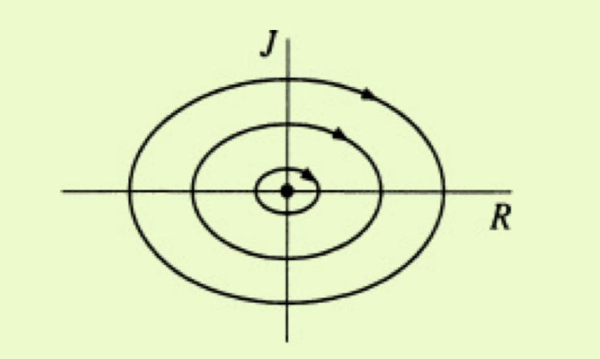
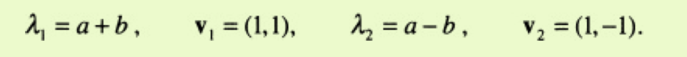
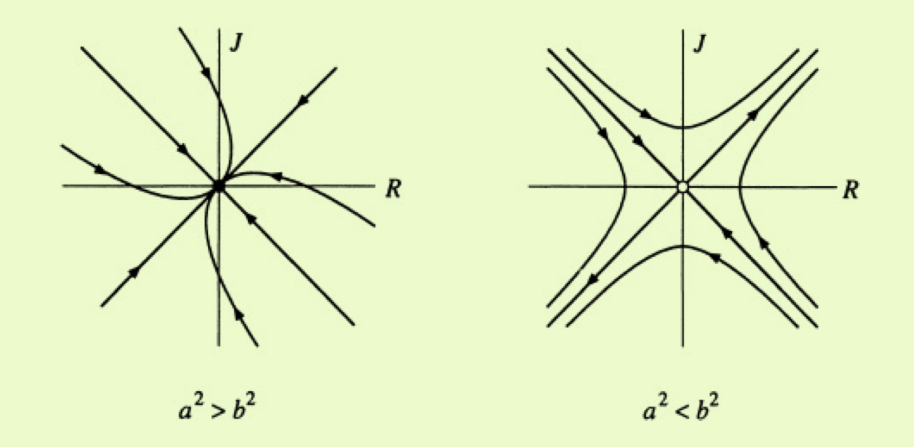

# linear systems

## 5.3 love affairs

Romeo is in love with Juliet, but in our version of this story, Juliet is a fickle lover. The more Romeo loves her, the more Juliet wants to run away and hide.
But  when  Romeo  gets  discouraged  and  backs  off,  Juliet  begins  to  find  him strangely attractive. Romeo, on the other hand, tends to echo her: he warms up when she loves him, and grows cold when she hates him.

Let 

R(t) = Romeo’s love/hate for Juliet at time t 

J(t) = Juliet’s love/hate for Romeo at time t.

$\dot R =aj$ 

$\dot J=-bR$ 

center at $R,J=(0,0)$  At least they manage to achieve simultaneous love one-quarter of the time

at general linear system

$$ \dot R = aR +bJ$$

$$ \dot J = cR +dJ $$

### EXAMPLE 5.3.1

$$ \dot R = aR +bJ$$

$$ \dot J = bR +aJ $$

so The corresponding matrix is

$$A= \begin{bmatrix}   a & b  \\   b & a   \end{bmatrix}  $$

Which is 

$\tau=2a<0$         $\Delta=a^2-b^2$      $\tau-4\Delta=4b^2>0$

Hence the fixed point (R,J) = (0,0) is a saddle point if a2 < b2 and a stable node if a2 > b2. 

(因此如果a2 <b2，则固定点（R，J）=（0,0）是鞍点；如果a2> b2，则固定点是稳定节点。)

The eigenvalues and corresponding eigenvectors are

由于a + b> a-b，因此，当原点为鞍点时，特征向量（1,1）跨越不稳定的流形；当原点为稳定节点时，特征向量（1,1）跨越慢的特征方向。 图5.3.2显示了两种情况的相图

如果a2> b2，则关系总是会变得相互冷漠。 教训似乎是，过度谨慎可能会导致冷漠。 如果a2 <b2，则恋人更加大胆，或者彼此更加敏感。 现在这种关系是爆炸性的。 最初取决于他们的感情，他们的关系要么成为爱情节，要么成为战争。 无论哪种情况，所有轨迹都接近线R = J，因此它们的感觉最终是相互的