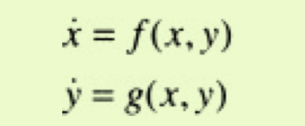
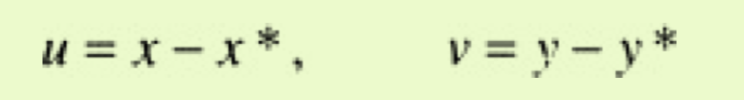
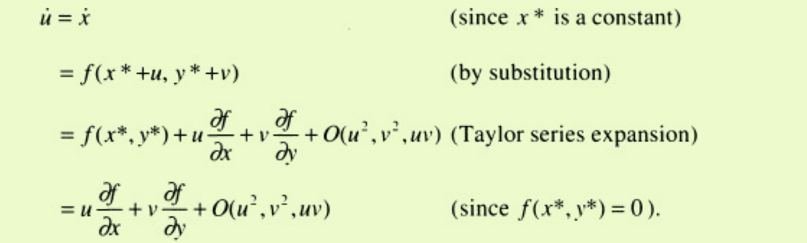

# PHASE PLANE

本章开始研究二维非线性系统。 首先，我们考虑它们的一些常规属性。 然后，根据对线性系统的了解，对可能出现的不动点进行分类（第5章）。 通过生物学（两个物种之间的竞争）和物理学（保守系统，可逆系统和钟摆）的一系列实例进一步发展了该理论。 本章结束时将讨论索引理论，这是一种提供有关相画像的全局信息的拓扑方法。 本章主要是关于固定点。 接下来的两章将讨论二维系统中的封闭轨道和分叉

## 6.3 Fixed Points and Linearization

let

we need differential equations for u and v

 

